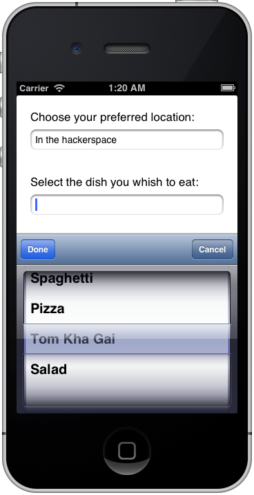

PickerInputView
===============

In your iOS apps, use this to get a picker (wheel) instead of a keyboard when the user taps an TextField.



Usage
=====

Note that currently this only works properly if you do use ARC.

Usage should be pretty straightforward, but here are step-by-step instructions.

Basic use
---------

First, drop the two files (`PickerInputView.h` and `PickerInputView.m`) into
your project.

Add a `TextField` to your view and give it a `Tag` number, for example `100`.
In your `ViewController`'s header file, import the header:

```objective-c
#import "PickerInputView.h"
```

and declare two methods which will be called when the user quits selecting by
clicking on the "Done" button:

```objective-c
- (void)locationSelected:(NSString*) location;
```

The implementation (`.m`) file of your `ViewController` is where the action
happens. First of all, you need to declare a variable which holds the picker
object, like so:

```objective-c
@interface ViewController () {
    // A "private" instance of the picker which is used as input for the TextField.
    PickerInputView* _ivLocation;
}
@end
```

In the `viewDidLoad` method of your `ViewController`, you'll need to create the
picker input view object, fill it with data and associate it to the text input.

```objective-c
    // The different choices the user can pick from.
    // In a real app, this data probably comes from some backend.
    NSArray *locations = [[NSArray alloc] initWithObjects:@"At home", @"At university", @"In the hackerspace", @"At work", @"In the spaceship", nil];

    // Creates the picker input view using the above data and sets
    // the callback to be this object's "locationSelected" method.
    // It will get the item the user selected as an argument.
    self->_ivLocation = [[PickerInputView alloc] initWithData:locations
                                                 andDoneTarget:self
                                                 andAction:@selector(locationSelected:)];

    // This associates the picker input view with the actual text field
    // of which it should replace the default virtual keyboard input method.
    self->_ivLocation.parent = (UITextField*)[self.view viewWithTag:100];
```

And that's it. You can now implement the callback function and do something
interesting with the user's selection in there:

```objective-c
- (void)locationSelected:(NSString*) location
{
    // Using this information, go ahead on your quest of world domination!
    NSLog(@"The user prefers to eat %@", location);
}
```

Adding a cancel button
----------------------
It is also possible to include a `Cancel` button in the picker. This is done by
sending the `initWithData:andDoneTarget:andAction:andCancel:` message and thus
registering an additional callback for the cancel button, as follows:

```objective-c
    // Aaaand the same story for dishes, but here we allow the user to cancel.
    NSArray *dishes = [[NSArray alloc] initWithObjects:@"Spaghetti", @"Pizza", @"Tom Kha Gai", @"Salad", nil];
    self->_ivDish = [[PickerInputView alloc] initWithData:dishes
                                             andDoneTarget:self
                                             andAction:@selector(dishSelected:)
                                             andCancel:@selector(dishCancelled)];
    self->_ivDish.parent = (UITextField*)[self.view viewWithTag:200];
```

Note that this cancellation callback doesn't take any arguments (and thus there
is no colon at the end of the name!):

```objective-c
- (void)dishSelected:(NSString*) dish
{
    NSLog(@"The user chose to eat a %@", dish);
}

- (void)dishCancelled
{
    NSLog(@"The user cancelled the dish selection.");
}
```

License: MIT
============

Copyright (C) 2013 Lucas Beyer

Permission is hereby granted, free of charge, to any person obtaining a copy of this software and associated documentation files (the "Software"), to deal in the Software without restriction, including without limitation the rights to use, copy, modify, merge, publish, distribute, sublicense, and/or sell copies of the Software, and to permit persons to whom the Software is furnished to do so, subject to the following conditions:

The above copyright notice and this permission notice shall be included in all copies or substantial portions of the Software.

THE SOFTWARE IS PROVIDED "AS IS", WITHOUT WARRANTY OF ANY KIND, EXPRESS OR IMPLIED, INCLUDING BUT NOT LIMITED TO THE WARRANTIES OF MERCHANTABILITY, FITNESS FOR A PARTICULAR PURPOSE AND NONINFRINGEMENT. IN NO EVENT SHALL THE AUTHORS OR COPYRIGHT HOLDERS BE LIABLE FOR ANY CLAIM, DAMAGES OR OTHER LIABILITY, WHETHER IN AN ACTION OF CONTRACT, TORT OR OTHERWISE, ARISING FROM, OUT OF OR IN CONNECTION WITH THE SOFTWARE OR THE USE OR OTHER DEALINGS IN THE SOFTWARE.

